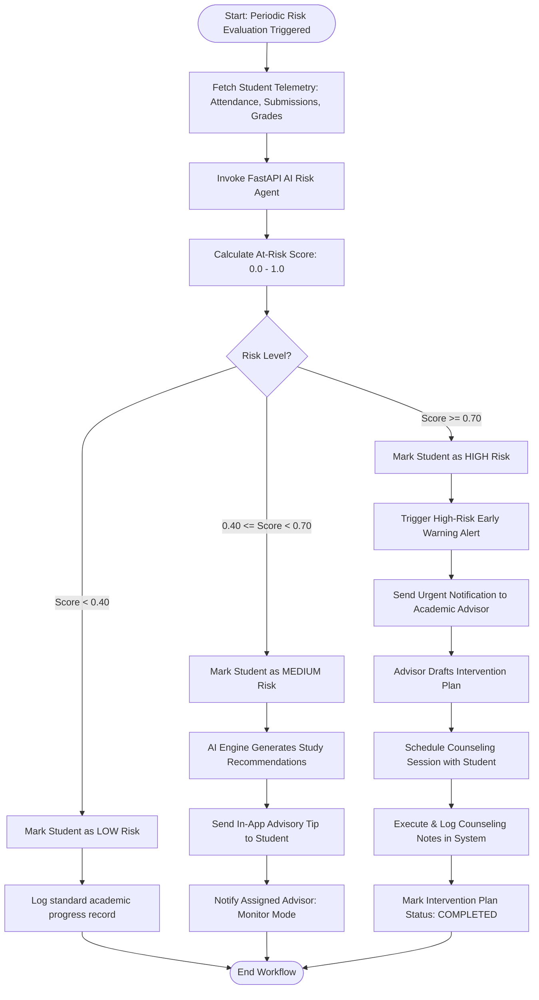
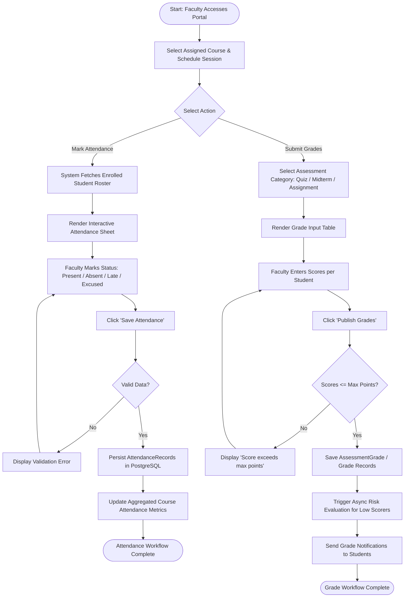
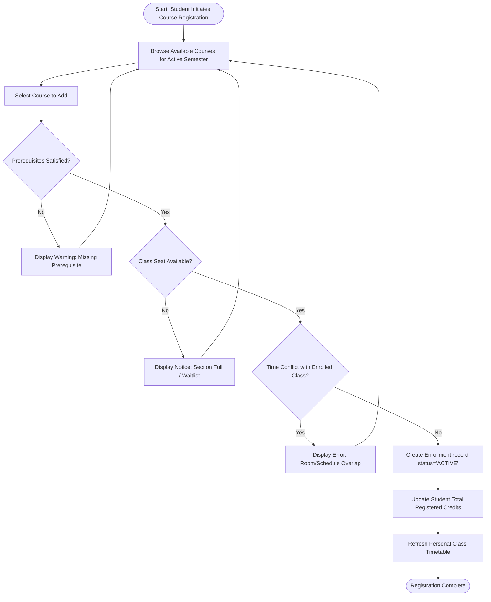

# UniMind (Alma UMS) — Activity Diagrams

This document outlines the operational **Activity Diagrams** for the key business workflows in the **UniMind (Alma UMS)** system.

---

## 1. Activity Diagram 1: Academic Early Warning & Intervention Process

---

## 2. Activity Diagram 2: Faculty Attendance Marking & Grade Submission Workflow

---

## 3. Activity Diagram 3: Student Course Registration Workflow

