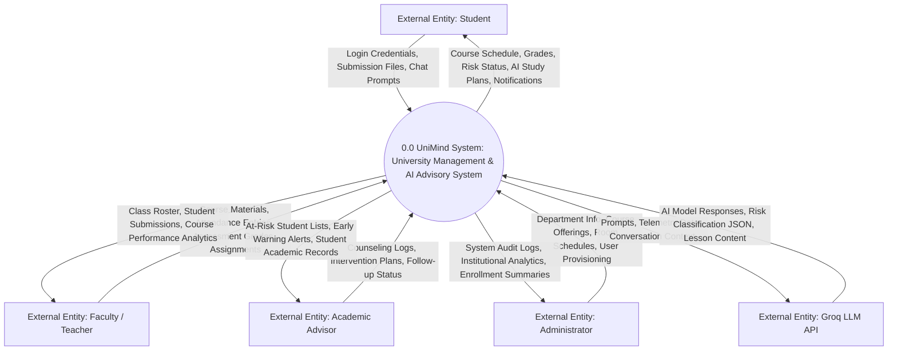
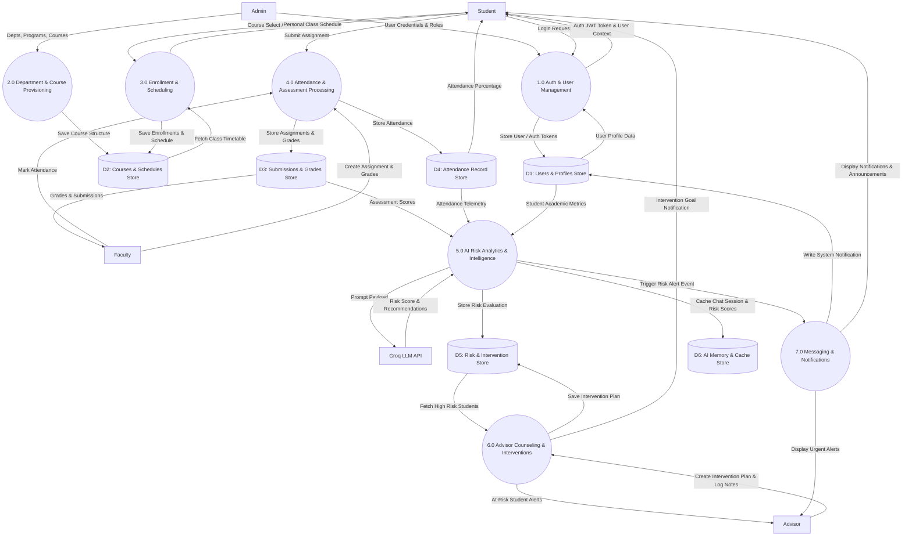

# UniMind (Alma UMS) — Data Flow Diagrams (DFD)

This document contains the **Data Flow Diagrams (DFD)** for the **UniMind (Alma UMS)** platform, including the **Context Diagram (Level 0)** and the detailed **Decomposition Data Flow Diagram (Level 1)**.

---

## 1. DFD Level 0: Context Diagram

The Context Diagram defines the system boundary for UniMind and illustrates all data inputs and outputs passing between external entities and the central system.

---

## 2. DFD Level 1: Process Decomposition Diagram

The Level 1 DFD decomposes Process 0.0 into seven functional subprocesses and details data flow interactions with primary data stores.

---

## 3. Data Store Reference Table

| Store ID | Data Store Name | Associated Database Tables / Services | Contents |
|---|---|---|---|
| **D1** | Users & Profiles Store | `CustomUser`, `StudentProfile` | User credentials, roles, email, student ID, CGPA, risk status. |
| **D2** | Courses & Schedules Store | `Department`, `Program`, `Semester`, `Course`, `Room`, `ClassSchedule`, `ExamSchedule` | University metadata, course definitions, room allocations, timetables. |
| **D3** | Submissions & Grades Store | `Assignment`, `Submission`, `Grade`, `AssessmentGrade` | Homework prompts, uploaded files, scores, letter grades, feedback. |
| **D4** | Attendance Record Store | `AttendanceRecord` | Per-session attendance records (Present, Absent, Late, Excused). |
| **D5** | Risk & Intervention Store | `InterventionPlan`, `CounselingLog` | AI-generated risk scores, advisor action items, meeting notes. |
| **D6** | AI Memory & Cache Store | Redis Cache Server | Conversation history buffers, AI prompt templates, session caches. |
