# UniMind (Alma UMS) — Entity Relationship Diagram (ERD)

This document describes the complete relational database architecture for the **UniMind (Alma UMS)** backend system, built on PostgreSQL (managed via Django ORM).

---

## 1. Mermaid Entity Relationship Diagram

```mermaid
erDiagram
    CustomUser ||--o| StudentProfile : "has profile (if role=STUDENT)"
    CustomUser }|--|| Department : "belongs to"
    CustomUser }|--o| CustomUser : "advised by (Student -> Advisor)"

    Department ||--|{ Program : "offers"
    Department ||--|{ Course : "hosts"
    Program ||--|{ StudentProfile : "enrolls"

    Course ||--|{ Enrollment : "has"
    Course ||--|{ ClassSchedule : "scheduled in"
    Course ||--|{ ExamSchedule : "has exams"
    Course ||--|{ Assignment : "contains"

    Semester ||--|{ Enrollment : "active in"
    Semester ||--|{ ClassSchedule : "runs during"
    Semester ||--|{ ExamSchedule : "runs during"

    CustomUser ||--|{ Enrollment : "enrolled as student"
    CustomUser ||--|{ ClassSchedule : "teaches as faculty"
    CustomUser ||--|{ Assignment : "created by faculty"
    CustomUser ||--|{ Submission : "submitted by student"

    Enrollment ||--|{ Grade : "receives final"
    Enrollment ||--|{ AssessmentGrade : "receives itemized"
    Enrollment ||--|{ AttendanceRecord : "tracks"

    ClassSchedule ||--|{ AttendanceRecord : "conducts session"
    Room ||--|{ ClassSchedule : "hosts class"
    Room ||--|{ ExamSchedule : "hosts exam"

    Assignment ||--|{ Submission : "collects"

    CustomUser ||--|{ InterventionPlan : "student targeted / advisor assigned"
    CustomUser ||--|{ CounselingLog : "counseled / authored by advisor"
    InterventionPlan ||--o| CounselingLog : "tracks progress in"

    CustomUser ||--|{ Notification : "receives"
    CustomUser ||--|{ Announcement : "publishes"
    Department ||--o| Announcement : "targets department"

    CustomUser {
        int id PK
        string username
        string email
        string first_name
        string last_name
        string role "ADMIN | FACULTY | STUDENT | ADVISOR"
        int department_id FK
        string phone
        string avatar
    }

    StudentProfile {
        int id PK
        int user_id FK "1:1 CustomUser"
        string student_id "Unique Reg No"
        date date_of_birth
        string gender
        int program_id FK
        int advisor_id FK "CustomUser (ADVISOR)"
        float cgpa
        int credits_completed
        string risk_level "LOW | MEDIUM | HIGH"
        int current_semester
    }

    Department {
        int id PK
        string code "e.g., CSE, EEE"
        string name
        string description
    }

    Program {
        int id PK
        int department_id FK
        string code
        string name
        string degree_type "BS | MS | PhD"
        int total_credits
    }

    Semester {
        int id PK
        string name "Fall 2026"
        string code "2026-FALL"
        date start_date
        date end_date
        boolean is_current
        string status "UPCOMING | ACTIVE | COMPLETED"
    }

    Course {
        int id PK
        int department_id FK
        string code "e.g., CSE-101"
        string title
        int credits
        string description
        boolean is_active
    }

    Enrollment {
        int id PK
        int student_id FK "CustomUser (STUDENT)"
        int course_id FK "Course"
        int semester_id FK "Semester"
        string status "ACTIVE | DROPPED | COMPLETED"
        float grade_points
    }

    Room {
        int id PK
        string building
        string room_number
        int capacity
        string room_type "LECTURE_HALL | LAB | SEMINAR"
    }

    ClassSchedule {
        int id PK
        int course_id FK
        int instructor_id FK "CustomUser (FACULTY)"
        int room_id FK
        int semester_id FK
        string day_of_week "MON | TUE | WED | THU | FRI | SAT"
        time start_time
        time end_time
    }

    ExamSchedule {
        int id PK
        int course_id FK
        int room_id FK
        int semester_id FK
        date exam_date
        time start_time
        time end_time
        string exam_type "MIDTERM | FINAL"
        string status "SCHEDULED | COMPLETED | CANCELLED"
    }

    Assignment {
        int id PK
        int course_id FK
        string title
        text description
        datetime due_date
        float max_points
        int created_by_id FK "CustomUser (FACULTY)"
    }

    Submission {
        int id PK
        int assignment_id FK
        int student_id FK "CustomUser (STUDENT)"
        text submission_text
        string file_url
        datetime submitted_at
        float score
        text feedback
        string status "SUBMITTED | GRADED | LATE"
    }

    Grade {
        int id PK
        int enrollment_id FK "1:1 Enrollment"
        float final_grade
        string letter_grade "A+ | A | B | C | D | F"
        datetime updated_at
    }

    AssessmentGrade {
        int id PK
        int enrollment_id FK
        string category "HOMEWORK | QUIZ | MIDTERM | FINAL | PROJECT"
        float score
        float max_score
        float weight
    }

    AttendanceRecord {
        int id PK
        int enrollment_id FK
        int class_schedule_id FK
        date date
        string status "PRESENT | ABSENT | LATE | EXCUSED"
    }

    InterventionPlan {
        int id PK
        int student_id FK "CustomUser (STUDENT)"
        int advisor_id FK "CustomUser (ADVISOR)"
        string title
        text description
        date target_date
        string status "DRAFT | ACTIVE | COMPLETED | CANCELLED"
        datetime created_at
    }

    CounselingLog {
        int id PK
        int student_id FK "CustomUser (STUDENT)"
        int advisor_id FK "CustomUser (ADVISOR)"
        int intervention_plan_id FK "InterventionPlan (optional)"
        text notes
        date session_date
        boolean follow_up_needed
    }

    Notification {
        int id PK
        int recipient_id FK "CustomUser"
        string title
        text message
        string kind "SYSTEM | RISK_ALERT | ASSIGNMENT | GRADE | ADVISING"
        boolean is_read
        datetime created_at
    }

    Announcement {
        int id PK
        int author_id FK "CustomUser (FACULTY/ADMIN)"
        string title
        text content
        string audience "ALL | STUDENTS | FACULTY | ADVISORS"
        int department_id FK "Department (optional)"
        datetime created_at
    }
```

---

## 2. Entity Summary & Key Constraints

1. **CustomUser (`apps.accounts.models.CustomUser`)**:
   - Extends Django's `AbstractUser`.
   - `role` choices: `ADMIN`, `FACULTY`, `STUDENT`, `ADVISOR`.
2. **StudentProfile (`apps.students.models.StudentProfile`)**:
   - `1:1` link with `CustomUser`. Stores academic metrics (`cgpa`, `risk_level`, `credits_completed`).
3. **Enrollment (`apps.courses.models.Enrollment`)**:
   - Connects `Student`, `Course`, and `Semester`. Unique together on `(student, course, semester)`.
4. **AttendanceRecord (`apps.attendance.models.AttendanceRecord`)**:
   - Connects `Enrollment` and `ClassSchedule`. Status tracking per class session date.
5. **AssessmentGrade & Grade (`apps.grades.models.Grade`)**:
   - `AssessmentGrade` handles continuous evaluation (quizzes, midterms).
   - `Grade` stores the aggregated final course letter grade.
6. **InterventionPlan & CounselingLog (`apps.advisors.models`)**:
   - Enables advisors to monitor at-risk students, establish corrective actions, and track meeting history.
