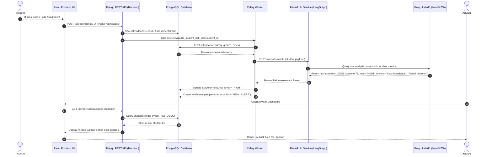
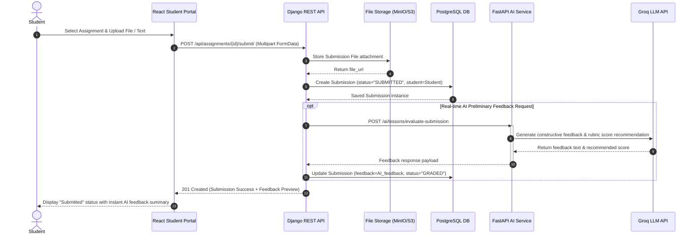
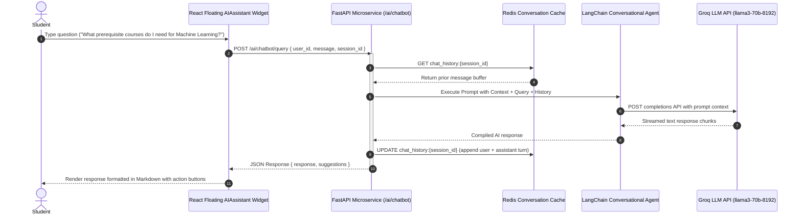

# UniMind (Alma UMS) — Sequence Diagrams

This document contains detailed **Sequence Diagrams** representing the interaction patterns across the React Frontend, Django REST API Backend, PostgreSQL Database, Celery Async Worker, FastAPI AI Microservice (LangGraph/Groq LLM), and Redis Cache.

---

## 1. Sequence 1: AI Academic At-Risk Assessment & Advisor Early Warning Flow

---

## 2. Sequence 2: Assignment Submission & AI-Assisted Automated Feedback Flow

---

## 3. Sequence 3: AI Advisory Chatbot Interaction Flow

