# UniMind (Alma UMS) — Use Case Diagram

This document presents the **Use Case Diagram** for the **UniMind (Alma UMS)** platform. It details all primary and secondary system actors, system boundaries, core use cases, and relationship dependencies (`<<include>>` and `<<extend>>`).

---

## 1. System Actors

| Actor | Type | Description |
|---|---|---|
| **Student** | Human | Enrolled university learner interacting with course material, attendance, assignments, and AI advisory features. |
| **Faculty / Teacher** | Human | Academic instructor responsible for course delivery, attendance logging, grade submission, and assignment evaluation. |
| **Academic Advisor** | Human | Faculty member or counselor monitoring student academic standing, high-risk alerts, and intervention plans. |
| **Administrator** | Human | System manager responsible for department, program, course, room, and user provisioning. |
| **AI Analytics Engine** | System / Secondary | Automated FastAPI/LangGraph AI service responsible for student risk detection, lesson plan generation, and conversational support. |

---

## 2. Mermaid Use Case Diagram

```mermaid
graph TB
    subgraph Actors
        S[Student]
        F[Faculty / Teacher]
        ADV[Academic Advisor]
        ADM[Administrator]
        AI[AI Analytics Engine]
    end

    subgraph "UniMind System Boundary"
        subgraph "Authentication & User Management"
            UC_Auth["UC-1: Authenticate / Login (JWT)"]
            UC_Profile["UC-2: Manage Profile & Roles"]
        end

        subgraph "Academic Administration"
            UC_ManageDept["UC-3: Manage Departments & Programs"]
            UC_ManageCourse["UC-4: Provision Courses & Sections"]
            UC_ScheduleClass["UC-5: Manage Schedules & Rooms"]
        end

        subgraph "Course & Learning Management"
            UC_Enroll["UC-6: Enroll in Courses"]
            UC_ViewCourses["UC-7: View Enrolled Courses"]
            UC_SubmitAssign["UC-8: Submit Assignment"]
            UC_Grading["UC-9: Grade Submissions & Record Marks"]
            UC_Attendance["UC-10: Mark Attendance"]
        end

        subgraph "AI Intelligence & Risk Management"
            UC_RiskAssess["UC-11: Compute Academic At-Risk Score"]
            UC_EarlyWarn["UC-12: Trigger Early Warning Notification"]
            UC_GenLesson["UC-13: Generate Personal AI Lesson Plan"]
            UC_AIChat["UC-14: Interact with AI Advisory Assistant"]
        end

        subgraph "Student Advising & Counseling"
            UC_ManageIntervention["UC-15: Create & Track Intervention Plan"]
            UC_LogCounseling["UC-16: Log Counseling Sessions"]
            UC_ViewProgress["UC-17: View Academic Standing & Risk"]
        end

        subgraph "Messaging & Communication"
            UC_Announce["UC-18: Broadcast System Announcements"]
            UC_Notify["UC-19: View In-App Notifications"]
        end
    end

    %% Relationships - Student
    S --> UC_Auth
    S --> UC_ViewCourses
    S --> UC_SubmitAssign
    S --> UC_GenLesson
    S --> UC_AIChat
    S --> UC_ViewProgress
    S --> UC_Notify

    %% Relationships - Faculty
    F --> UC_Auth
    F --> UC_Grading
    F --> UC_Attendance
    F --> UC_ViewProgress
    F --> UC_Announce

    %% Relationships - Advisor
    ADV --> UC_Auth
    ADV --> UC_ViewProgress
    ADV --> UC_ManageIntervention
    ADV --> UC_LogCounseling
    ADV --> UC_Notify

    %% Relationships - Administrator
    ADM --> UC_Auth
    ADM --> UC_Profile
    ADM --> UC_ManageDept
    ADM --> UC_ManageCourse
    ADM --> UC_ScheduleClass
    ADM --> UC_Announce

    %% System Actor - AI Analytics Engine
    AI --> UC_RiskAssess
    AI --> UC_EarlyWarn
    AI --> UC_GenLesson
    AI --> UC_AIChat

    %% Include / Extend relationships
    UC_SubmitAssign -. "<<include>>" .-> UC_Auth
    UC_Grading -. "<<include>>" .-> UC_Auth
    UC_Attendance -. "<<include>>" .-> UC_Auth
    UC_RiskAssess -. "<<extend>>" .-> UC_EarlyWarn
    UC_RiskAssess -. "<<extend>>" .-> UC_ManageIntervention
    UC_AIChat -. "<<include>>" .-> UC_Auth
```

---

## 3. Detailed Use Case Specification Summary

### UC-11: Compute Academic At-Risk Score
- **Primary Actor**: AI Analytics Engine
- **Preconditions**: Student attendance and assessment grade records exist.
- **Main Flow**:
  1. System collects attendance percentage, assignment submission timeliness, and assessment grades.
  2. AI engine runs risk evaluation agent (LangGraph graph with Groq LLM `llama3-70b-8192`).
  3. Risk status assigned: `LOW`, `MEDIUM`, `HIGH`.
  4. Risk score stored in DB cache and pushed to dashboard state.

### UC-15: Create & Track Intervention Plan
- **Primary Actor**: Academic Advisor
- **Secondary Actor**: AI Analytics Engine (provides risk data)
- **Preconditions**: Student identified as `MEDIUM` or `HIGH` risk.
- **Main Flow**:
  1. Advisor views assigned student list sorted by risk level.
  2. Advisor initiates an Intervention Plan (specifying target milestone, action items, target completion date).
  3. Advisor logs counseling session notes in CounselingLog.
  4. System notifies the student and updates intervention status (`DRAFT` -> `ACTIVE` -> `COMPLETED`).
